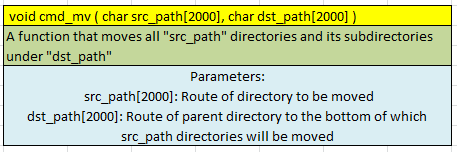
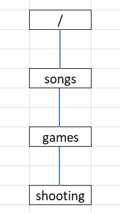

# Directory_System

The computer OS uses an organizational unit called "directory" to organize the folder and files into a hierarchical structure.
A directory contains multiple files and other directories and it provides user with a logical file group.

A directory uses "/" as a separator character and shows its route within the file system.
"/" may represent a root directory or a hierarchical relationship between parent directories and subdirectories.
For instance, "/aa/bb" indicates that under the root directory, there is the "aa" directory, beneath which lies the "bb" directory.

There are various features related to a directory but following 5 features are implemented in this project
- Create a directory
- Remove a directory
- Copy   a directory
- Move   a directory
- Check the number of subdirectories

 
 
  
  
#### Look at the table below in which functions are called in following order ####

 
 

#### When functions #1 to #4 are called, the directory structure will be like this [Fig. 1] ####

 
 

#### When function #5 is called, the directory structure will be like this [Fig. 2] ####

 
 

#### When function #6 is called, the directory structure will be like this [Fig. 3] ####

 
 

#### When function #7 is called, the directory structure will be like this [Fig. 4] ####

 
 

#### When function #9 is called, the directory structure will be like this [Fig. 5] ####

 
 

## Constraints ##
* Maximum directories that can be made is 50,000
* The directory name is made of small letters and its length is >=2 and <=6
* The route of every directory is not longer than 1999
* No directories under same parent have same name
* Only upto 30 directories can have same parent directory

## How to Compile and Run Project ##
* git clone https://github.com/HarryAhuja/Directory_System.git
* cd Directory_System/
* make clean
* make -j
* ./directory.exe  -->(directory is the name of executable)
* Output of the program should be "#Test Case:1 Passed"
* All Object files will be stored in Directory_System/output/ folder
